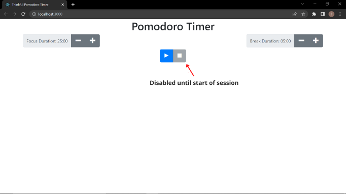

# Pomodoro Timer

The Pomodoro Technique is a time management method developed by Francesco Cirillo in the late 1980s.
The technique uses a timer to break down work into intervals, traditionally 25 minutes in length, separated by short breaks. Each interval is known as a pomodoro, from the Italian word for 'tomato', after the tomato-shaped kitchen timer that Cirillo used as a university student.

You will implement a Pomodoro timer that follows these steps (simplified from the original technique):

1. Set the focus duration (default to 25 minutes, no less than 5 or more than 60).
1. Set the break duration (default to 5 minutes, no less than 1 or more than 15).
1. When the user clicks the "play" button, the timer starts.
1. When the focus time expires, an alarm plays and then the break timer starts.
1. When the break time expires, the alarm plays again and then the focus timer starts.

This application uses [Bootstrap 4](https://getbootstrap.com/) for styling and [Open-Iconic icons](https://useiconic.com/open) for icons.

## Initial Screen

The initial screen lets the user set the length of the focus and break and break sessions. 



The "stop" button is disabled on the initial screen because the user has not yet started the timer.  

When the user clicks the "play" button, the timer will always start a new focus session.

## Active Session Screen

After the user clicks the "play" button, the buttons to change the focus and break duration are disabled and the session timer appears. 

 

The session timer shows the type of session, either "Focusing" or "On Break", the total duration of the session, the time remaining, and a progress bar showing how much of the session is complete.

## Paused Session Screen

If the user clicks the "pause" button, "paused" appears below the time remaining. 

 

The session timer shows the type of session, either "Focusing" or "On Break", the total duration of the session, the time remaining, and a progress bar showing how much of the session is complete.

## Stoping a session

Stopping a session returns the application to the initial screen and the user is able to change the focus and break duration. 

Clicking the "play" button will always start a new focus session.

## Setup

Clone a fork of this repository and run

```shell
cd pomodoro-timer
npm install
```


## Specific instruction

1. The code has various TODO items that should help you build the project as expected. With that said, feel free to make the changes you feel are necessary to accomplish the tasks.
1. Break up the code into at least two additional components that have a single responsibility.
1. The user cannot change the duration of the focus or break during a focus or break session. 
1. Display durations as `mm:ss`. i.e. 05:00 for 5 minutes or 18:45 for eighteen minutes and forty-five seconds.
1. The tests use the `data-testid="..."` attributes on elements. Removing these will break one or more tests.

## Using `setInterval` in React

Using `setInterval` with React functional components requires a custom hook. 

We have provided a custom [`useInterval`](./src/useInterval/index.js) hook for you to use that is already setup to start and stop with the play/pause buttons

You may not have learned about hooks yet, but don't worry, this function works exactly like `setInterval` except you don't use `clearInterval` to stop it. 

As it is currently configured, the `useInterval` will execute the code in the callback every second, unless `isTimerRunning` is set to false.
This should be sufficient to implement the pomodoro timer.

## Playing Audio alarm

Use the following code to play an alarm when the time expires. There are sample mp3 files located in the `public` directory that you can use, use any mp3 you like..
```javascript
new Audio(`${process.env.PUBLIC_URL}/alarm/submarine-dive-horn.mp3`).play();
```

## classNames function

`import classNames from "../utils/class-names";`

Use this function to dynamically assign the className property of react components.

Usage:
```jsx
<span className={classNames({
                "oi": true,
                "oi-media-play": currentState.isPaused,
                'oi-media-pause': !currentState.isPaused
              })}/>
 ```
 if currentState.isPaused === true, the className will be "oi oi-media-play" otherwise it will be "oi oi-media-pause"
 
`classNames` takes a map of a class name to a boolean value. If the boolean value is `true`, the class name is included, otherwise it is excluded.

returns: A space delimited string of the class names which have a value of `true`.

## minutesToDuration function

**minutesToDuration** formats a number of minutes as 'mm:00'. For example,

```javascript
import {minutesToDuration} from '../utils/duration';
minutesToDuration(3) // '03:00'
minutesToDuration(45) // '45:00'
```

## secondsToDuration fuction

**secondsToDuration** formats a number of seconds as 'mm:ss'. For example,

```javascript
import {secondsToDuration} from '../utils/duration';
secondsToDuration(305) // '05:05'
secondsToDuration(930) // '15:30'
```
